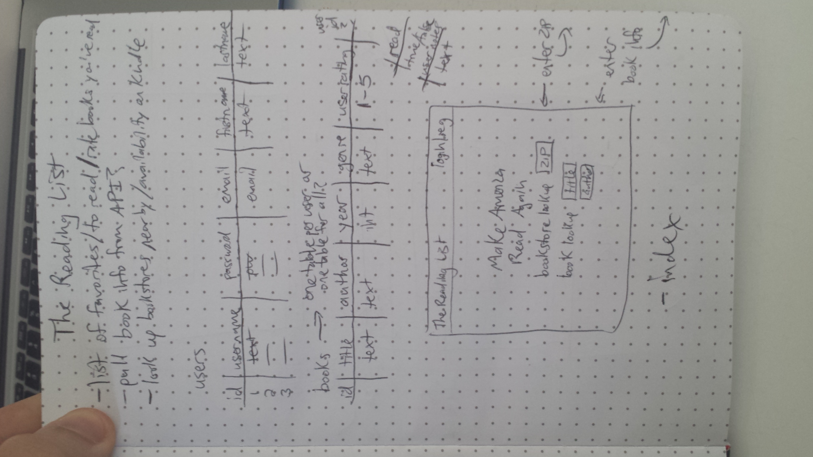
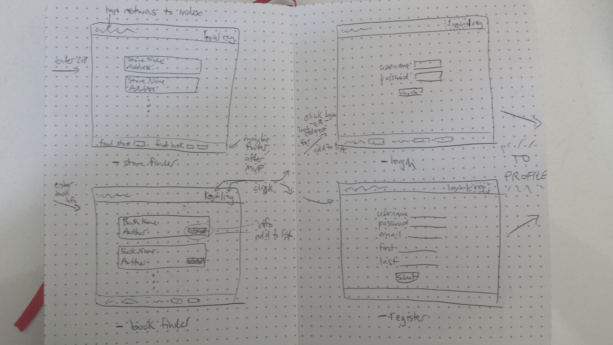
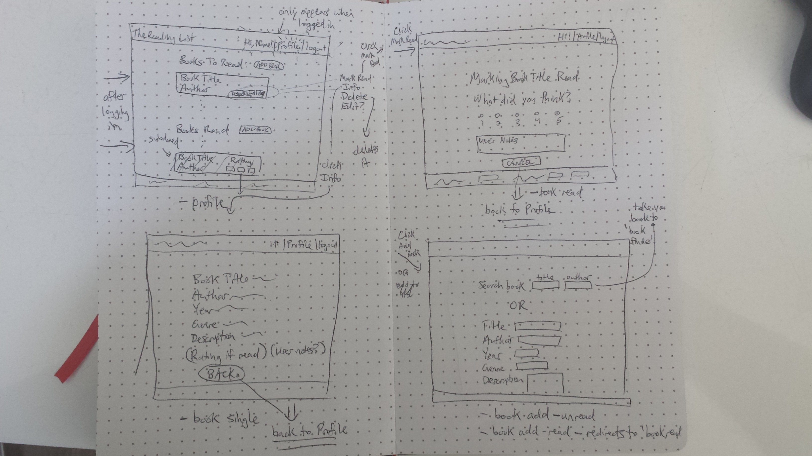
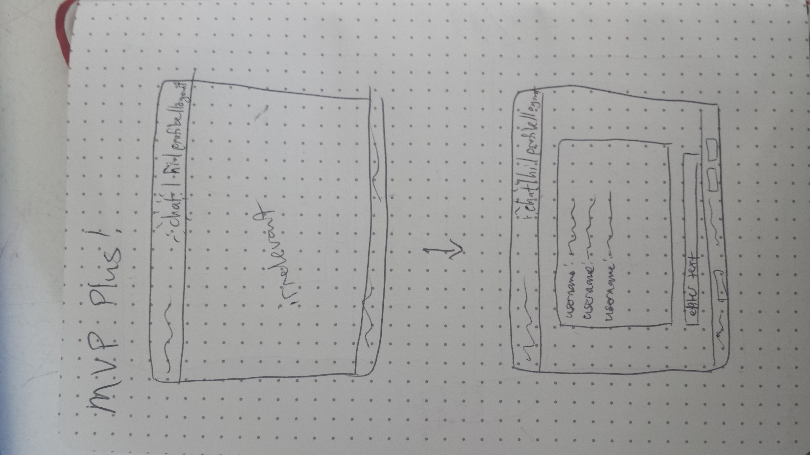

*** Ryan Edwards / 7/31/17 ***

# The Reading List Proposal

## What is The Reading List?

Sometimes, one of the biggest obstacles to keeping a good book in your hands is knowing what to read next. Take Ryan, for instance. He's been meaning to read Slaughterhouse-Five for years, but every time he makes a mental note to read it, it ends up slipping his mind, and Kurt Vonnegut's supposed masterpiece goes unread. The Reading List allows Ryan to etch it online to keep track of books he is intending to read. Then, later, after he has read it, he can keep track of how much he liked it and make some notes on it.

Oh, but what if Ryan's a novice to the reading world, he doesn't have a library and doesn't know where all his neighborhood bookstores are? The Reading List is there for him as well. All he has to do is enter his zip code into the app and it will tell him where nearby bookstores are so he can go buy the books on his list. 

Maybe it might even tell him if Amazon has it on Kindle?

Maybe it might allow him to look up books based on title or author and add them to his list?

Maybe one day it might even have a chat-room to allow him to BS with like-minded book-loving individuals.

The possibilities are endless.

## Wireframe

## Initial thoughts on app structure

The app's structure will separate its features into Pre-login and Post-login functionality.

Pre-login will allow anonymous users to search for bookstores by zip code and to search for books by title (and maybe author). Both of these features will draw from APIs to get this information. The store finder will return store names and addresses, and possibly a link to Google Maps (MVP+). The book finder will let users view info and add to list. If an anonymous user clicks add to list, they will be prompted to log in.

Post-login will allow users to add books to a reading list (APP TITLE) database. They can do this from the API search or enter information manually. Once they have read the book, they can mark it as read and leave what they think about it in the form of a rating and user notes. They can also view info, delete and edit the book info just like in all the other apps we've done. Books that have been read will be separated and moved to the bottom of the page.

The work will be voluminous, but I think the anything involving database wrangling should be doable. The real challenges I forsee will largely involve working the the API data and getting that working. I did the pizza location lookup, so I feel like the store lookup should be something similar to that. I might implement a chat aspect for fun, but that's MVP++ and probably won't happen.

## Phases of Completion

### Zero phase
Create a file structure.

### First phase
Set up the user authentication aspect, as it is vital to the nature of the app.

### Second phase
Set up the basic CRUD functionality, allowing users to CRUD books manually, basically the total implementation of the todo app, but with books.

### Third phase - MVP
>Completion of third phase will be MVP, a user-specific reading list.

Divide books by whether or not they are read, let the users mark them as read, and let users leave feedback (rating and notes) for future reference.

### Fourth phase 
Allow the user to look up nearby bookstores by ZIP code, using an API lookup, similar to the pizza app.

### Fifth phase 
Allow the user to look up books based on title using an API lookup, and add books to their list from the results.

## Links and Resources

[Google Maps API for geocoding & places](https://developers.google.com/maps/)

[Google Books API for looking up book information](https://developers.google.com/books/)