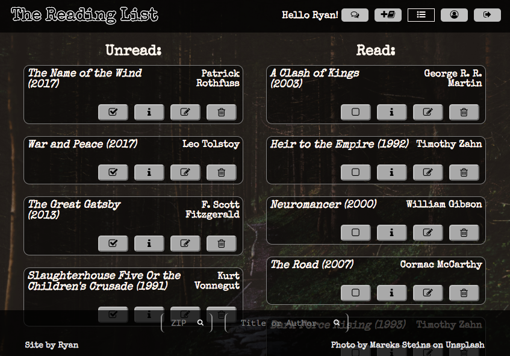

# The Reading List



## What is The Reading List?

Sometimes, one of the biggest obstacles to keeping a good book in your hands is knowing what to read next. Take Ryan, for instance. He's been meaning to read Slaughterhouse-Five for years, but every time he makes a mental note to read it, it ends up slipping his mind, and Kurt Vonnegut's supposed masterpiece goes unread. The Reading List allows Ryan to etch it online to keep track of books he is intending to read. Then, later, after he has read it, he can keep track of how much he liked it and make some notes on it.

Oh, but what if Ryan's a novice to the reading world, he doesn't have a library and doesn't know where all his neighborhood bookstores are? The Reading List is there for him as well. All he has to do is enter his zip code into the app and it will tell him where nearby bookstores are so he can go buy the books on his list, with a handy link to Google Maps to tell him how to get there. It will also allow him to look up books based on title or author and add them to his list.

Not only that, it has a chatroom to allow him to BS with like-minded book-loving individuals.

The possibilities are endless. All you have to do is log in.

I chose to make this app because it had a simple premise that could easily be expanded upon to make full use of the concepts that I've learned thus far.

## Technical Discussion

This game made heavy use of HTML/EJS, Javascript (including Express, Node, PG-Promise, jQuery, and SOCKET.IO for the chatroom), PSQL, and CSS. Lots and lots of CSS.

*APIs I used:*
- Google Geocode API to get a lat/longitude for a ZIP code
- Google Places API for finding bookstores
- Google Books API to look up book information
- I was trying to use a quotes API for the front page, but it didn't like working with a localhost, so I just stuck with the John Waters quote.

*Modules I used:*
All the usual modules we've been using for Unit 2 (express, morgan, body-parser, passport, etc), plus
- 'http' (for socket.io)
- 'serve-favicon', which allows Express apps to set a favicon (the little icon that shows up at the top of a tab in Google Chrome)

### Notes on Game Structure

```javascript
// socket.io chat server functionality
let users = {};

io.on('connection', function(socket) {
  let username = socket.handshake.query.username;
  socket.emit('welcome', {users: users, greeting: `hello ${username}!`});
  socket.broadcast.emit('new user', `${username} has joined`);

  users[socket.id] = username;
  console.log(users);
  console.log('new connection from ' + socket.id + ', also known as ' + users[socket.id]);

  socket.on('chat message', function(message) {
    // console.log('message: ' + message);
    if (message === '>userlist') {
      socket.emit('list users', users);
    } else {
      socket.emit('chat message', {username: users[socket.id], message: message});
      socket.broadcast.emit('chat message', {username: users[socket.id], message: message});
    };
  });

  socket.on('disconnect', function() {
    console.log(socket.id + ' (AKA ' + users[socket.id] +') disconnected');
    socket.broadcast.emit('user left', users[socket.id] + ' has left!')
    delete users[socket.id];
    console.log(users);
  });
});
```
Above is the code I used as to power the server side of my chatroom. Since the lecture we had on SOCKET.IO was so spartan, I was pretty proud to be able to fill out more functionality on my own.

## The Making of Blackjack

Thanks to Ramsey for pointing out that I needed to put server.listen instead of app.listen for socket.io to work, to Philip for un-f*cking my API functions in main.js, and to my wife Yue for heading to Boston for the weekend so I could obsess over this app.


## Opportunities for Future Growth

If I had more time, I would implement working with categories, putting book cover images in the book single info (image URLs are in the Google Books API, I just never got around to using them), finding another book API to get actual original published dates instead of reprints. I would also flesh out my chatroom further, with private messages, more key words (I put in '>username', which prints out all users in the room, so more like that). 